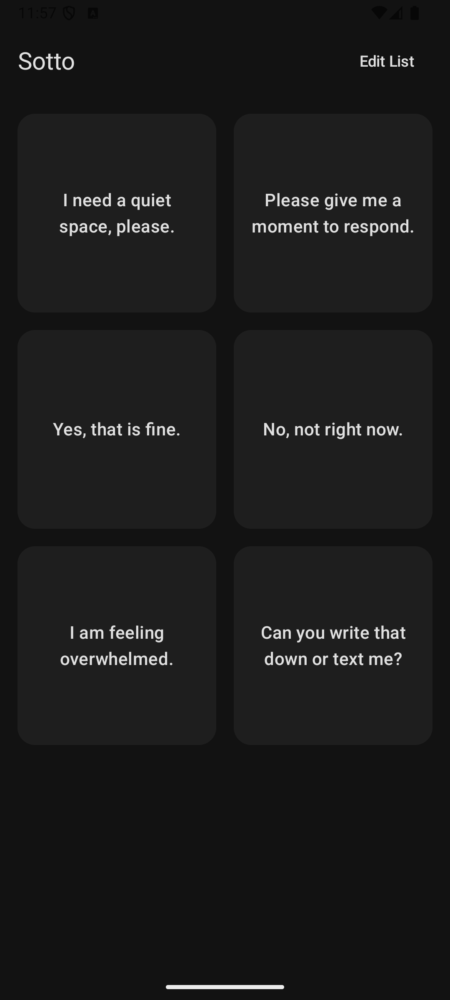

# Sotto

**TL;DR**: Sotto (meaning *"under one's breath"* or a soft voice) is an assistive communication Android app designed for autistic teens and adults, featuring a dignified, low-stimulation UI and one-touch Text-to-Speech (TTS).

<p align="center">
  
</p>

## Features
- **Modern Low-Stimulus UI**: Dark/Neutral Material 3 theme with high contrast text, avoiding visual clutter.
- **Zero-Distraction Layout**: The main interface has zero administrative buttons, providing a safe, predictable communication environment.
- **Instant Speech**: Tap a phrase card to speak immediately. Sotto automatically detects the text language for seamless multilingual playback.
- **High-Visibility Display**: Long press a phrase to open a full-screen, high-contrast modal for silent communication in noisy environments.
- **Customizable**: Toggle "Edit List" to add, edit, delete, and drag-and-drop to rearrange phrase cards.
- **Configurable Voice & Language**: Choose your App Language from installed TTS packages. Adjust speech rate and pitch with a live "Test Voice" preview.
- **Voice Input Support**: Use the microphone button to quickly dictate phrases in your selected App Language.
- **Offline Capable**: Completely local processing (depending on your device's TTS and speech recognition settings) with zero tracking.

## How to Install (For Users)
1. On your Android phone, go to the [Releases](https://github.com/triton1502oc/Sotto/releases) page.
2. Scroll to the latest release and download the `.apk` file (e.g., `Sotto-v1.3.4.apk`) found under "Assets".
3. Once downloaded, open the file from your notifications or using a File Manager app.
4. Your phone may warn you about installing from "Unknown Sources". Tap "Settings" on the prompt and toggle the switch to allow your browser or file manager to install the app.
5. Tap "Install". You're ready to use Sotto!

## Build (For Developers)
```bash
./gradlew assembleDebug
```

## License
This project is licensed under the Apache License 2.0 - see the [LICENSE](LICENSE) file for details.
