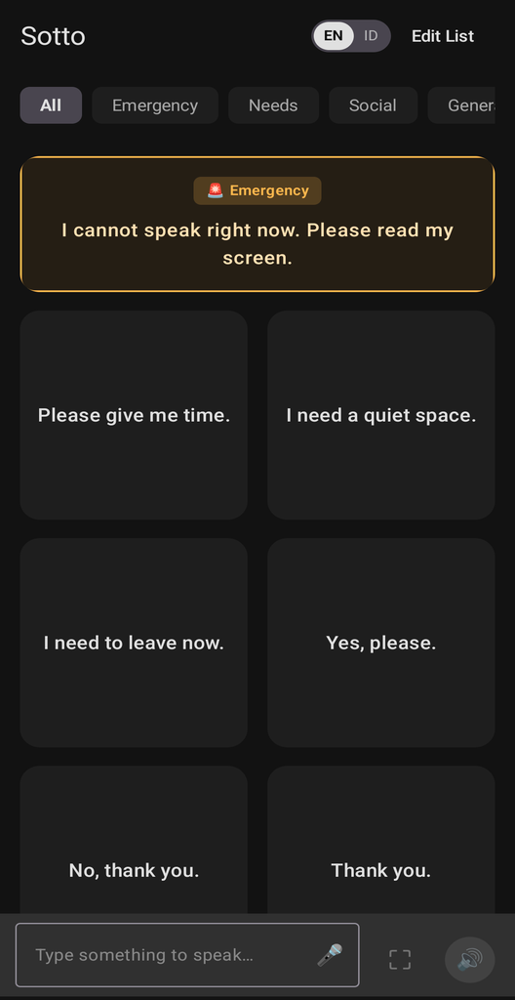

# Sotto

**TL;DR**: Sotto (*"under one's breath"*) is a dignified, low-stimulation assistive communication (AAC) Android app for autistic teens, adults, speech-impaired individuals, and anyone needing one-touch Text-to-Speech (TTS).

<p align="center">
  
</p>

<p align="center">
  🎬 <b>Video Demo:</b> 
  <a href="https://www.youtube.com/watch?v=xpPbsiT7jks">English</a> • 
  <a href="https://www.youtube.com/watch?v=UBBUd36im48">Indonesian</a>
</p>

---

## Target Audience
- **Autistic Teens & Adults**: Sensory-friendly dark-neutral UI free of pediatric clutter, designed for daily communication and verbal shutdowns.
- **Speech-Impaired Individuals**: Accessible one-touch speech for apraxia, dysarthria, ALS, stroke recovery (aphasia), and vocal chord paralysis.
- **Situational Speech Loss**: Vocal fatigue, post-surgical recovery, or silent communication in noisy spaces.

---

## Key Features
- **Low-Stimulus UI**: Dark-neutral Material 3 theme with high contrast, calm tones, and zero visual distractions.
- **Zero-Distraction Mode**: Administrative actions (add, edit, delete, reorder) remain hidden during communication.
- **Emergency Hero Card**: Prominent high-contrast card and fullscreen banner for non-verbal episodes and bystanders.
- **Quick-Speak Bar**: Docked bottom bar for spontaneous speech (`🔊`), fullscreen expand (`⛶`), voice dictation (`🎤`), and 1-tap card creation (`+`).
- **Contextual Categories**: Filter cards by situation (**All**, **Emergency**, **Needs**, **Social**, **General**).
- **Instant Speech & Attention Chime**: One-tap TTS playback with optional pre-speech alert tone and haptics.
- **High-Visibility Fullscreen**: Long-press any card to show giant text for silent, readable communication.
- **Dual-Language & On-Device Translation**: Display in one language, speak in another, with 100% offline ML Kit translation.
- **100% Private & Offline**: Zero analytics, zero accounts, and zero cloud data transmission.

---

## Installation

### For Users
1. Download the latest `.apk` from [Releases](https://github.com/triton1502oc/Sotto/releases).
2. Open the downloaded file (allow "Install Unknown Apps" if prompted by Android).
3. Tap **Install** and launch Sotto.

### For Developers
```bash
./gradlew assembleDebug
```
- **Language & Localization**: See [docs/LANGUAGE_AND_LOCALIZATION.md](docs/LANGUAGE_AND_LOCALIZATION.md).
- **Device Debugging**: See [docs/RUNNING_ON_DEVICE.md](docs/RUNNING_ON_DEVICE.md).
- **Contributing & Guidelines**: See [CONTRIBUTING.md](CONTRIBUTING.md).

---

## License
Licensed under the [GNU General Public License v3.0](LICENSE) (with Apple App Store Exception).

