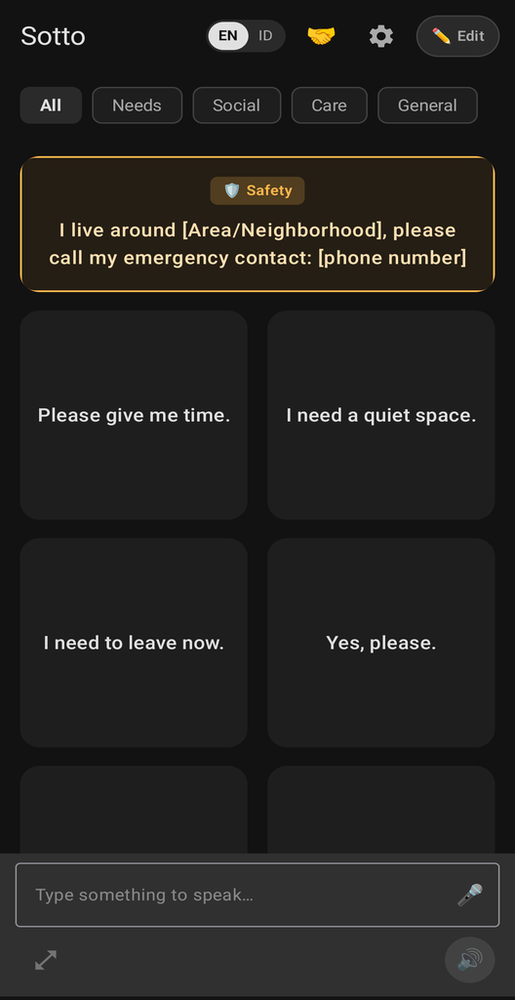

# Sotto

**TL;DR**: Sotto (*"under one's breath"*) is a calm yes/no tool for caregivers to reach autistic teens & adults in meltdowns and verbal shutdowns, paired with a dignified, low-stimulation AAC speech board for self-expression.

<p align="center">
  
</p>

<p align="center">
  🎬 <b>Video Demo:</b> 
  <a href="https://www.youtube.com/watch?v=UKZu5ZsdORg">English</a> • 
  <a href="https://www.youtube.com/watch?v=4CvpJkjaz-k">Indonesian</a>
</p>

---

## Origin & Mission
Sotto was created by a father to navigate overwhelming communication breakdowns and meltdowns with his autistic sons (ages 22 and 15). When sensory overload strikes, speaking, reading long sentences, or processing complex questions becomes exhausting or impossible.

**Primary Mission (Crisis Navigation for Caregivers & Families):**  
Provide parents, siblings, family members, caregivers, therapists, and educators with an immediate two-way receptive triage HUD and low-cognitive-load yes/no inquiry to reach loved ones during meltdowns and shutdowns without escalating distress.

**Secondary Purpose (Dignified Voice for Non-Speaking & Unclear Speech):**  
Provide non-speaking individuals, those with unclear or dysfluent speech, and anyone navigating verbal fatigue with a clean, mature text-to-speech board and spontaneous quick-speak bar—free of pediatric cartoons, patronizing symbols, and visual clutter.

---

## Target Audience
- **Parents, Siblings, Family, Caregivers, Therapists & Teachers**: Reaching loved ones during verbal shutdowns, cognitive freezes, and meltdowns with immediate 1-tap de-escalation; discovering hidden root causes through structured inquiry.
- **Autistic Teens & Adults**: Dignified self-advocacy and daily communication with high-contrast, low-stimulation phrase cards and giant fullscreen text.
- **Individuals with Unclear, Fatigued, or Non-Speaking Speech**: Accessible one-touch speech for motor apraxia, dysarthria, cerebral palsy, ALS, stroke recovery (aphasia), quiet/strained voices, or situational speech loss.

---

## Key Features

### 1. Emergency Triage & Crisis Navigation (Caregiver-First)
- **Two-Way Speak HUD & 180° Flip (`🤝`)**: Immediate emergency de-escalation for acute meltdowns and verbal shutdowns. Caregivers speak naturally or pick urgent preset prompts, flip the display 180° on a table, and the individual responds with one tap (`Yes`, `No`, `Not sure`, `Stop`) with instant voice confirmation. Zero demand fatigue or cognitive load.
- **Why Finder Diagnostic Tree (`🧭`)**: A guided, low-stimulus yes/no branching tree to uncover hidden root causes (acute physical pain, body part location, sensory overload, routine disruption) when triggers are unclear or during post-crisis recovery.
- **Private Why Log & 30-Day Trend Insights**: Automatically logs resolved crisis events locally in private app storage. Highlights top 30-day root-cause patterns and peak time-of-day triggers to help families and therapists identify recurring environmental stressors.
- **Customizable Why Tree (`🌳`)**: Personalize branching questions and resolution steps with voice dictation (`🎤`), sequence reordering, and one-tap clinical defaults reset.

### 2. Dignified Self-Expression (AAC Phrase Board)
- **Low-Stimulus UI**: Dark-neutral Material 3 theme with high contrast, calm earth tones, and zero cartoon animations or visual distractions.
- **Zero-Distraction Mode**: Administrative actions (add, edit, delete, reorder) remain hidden during communication.
- **Emergency Bystander Card**: Prominent high-contrast card and fullscreen banner for non-verbal episodes and medical personnel.
- **Quick-Speak Bar**: Docked bottom bar for spontaneous speech (`🔊`), fullscreen expand, voice dictation (`🎤`), and 1-tap card creation (`+`).
- **Contextual & Custom Categories**: Filter cards by situation (**Emergency**, **Needs**, **Social**, **Care**, **General**), or customize your own categories.
- **High-Visibility Fullscreen**: Long-press any card to show giant text for silent, readable communication in loud spaces.
- **Dual-Language & On-Device Translation**: Display cards in one language while speaking in another, with 100% offline ML Kit models.

### 3. Privacy & Offline Guarantee
- **100% Offline Core**: Zero cloud accounts, zero ads, and zero third-party tracking SDKs. Audio, phrases, Why Finder trees, and Why logs stay strictly on-device.
- **Backup & Restore v2**: Full JSON backup with selective checkboxes for phrases, Why tree, and private Why log. Easily export a customized tree to a therapist or teacher without sharing private crisis notes.
- **Optional Usability Telemetry**: Strictly opt-in (default OFF) anonymous interaction telemetry to help diagnose accessibility friction (zero text, audio, or phrase hashes collected).

---

## Installation

### Option 1: Google Play Beta (Closed Testing)
Receive automatic background updates through Google Play:

1. **Join the Testers Group**:  
   Join with the Google account used on your Android device:  
   👉 [**Join Sotto Testers Group**](https://groups.google.com/g/sotto-testers) *(tap "Join group")*
2. **Opt In & Download**:  
   After joining the group, opt in and install via Google Play:  
   👉 [**Join on Android (Play Store)**](https://play.google.com/store/apps/details?id=com.amh.sotto) or [**Join on the Web**](https://play.google.com/apps/testing/com.amh.sotto)
3. Tap **"Become a tester"**, then install Sotto directly from Google Play.

> **Tip**: If Google Play shows *"App not available"*, ensure you are signed into the Play Store with the same Google account that joined the Google Group.

---

### Option 2: Direct APK Download (Offline / Sideload)
For offline devices, deGoogled systems, or quick testing without a Google account:

1. Download the latest `.apk` from [Releases](https://github.com/triton1502oc/Sotto/releases).
2. Open the downloaded file (allow "Install Unknown Apps" if prompted by Android).
3. Tap **Install** and launch Sotto.

### For Developers & Documentation
```bash
export JAVA_HOME="/opt/homebrew/opt/openjdk@17/libexec/openjdk.jdk/Contents/Home" PATH="$JAVA_HOME/bin:$PATH"
./gradlew assembleDebug
```
- **Caregiver & User Guide**: See [docs/CAREGIVER_GUIDE.md](docs/CAREGIVER_GUIDE.md).
- **Language & Localization**: See [docs/LANGUAGE_AND_LOCALIZATION.md](docs/LANGUAGE_AND_LOCALIZATION.md).
- **Device Debugging**: See [docs/RUNNING_ON_DEVICE.md](docs/RUNNING_ON_DEVICE.md).
- **Contributing & Guidelines**: See [CONTRIBUTING.md](CONTRIBUTING.md).

---

## License
Licensed under the [GNU General Public License v3.0](LICENSE) (with Apple App Store Exception).
