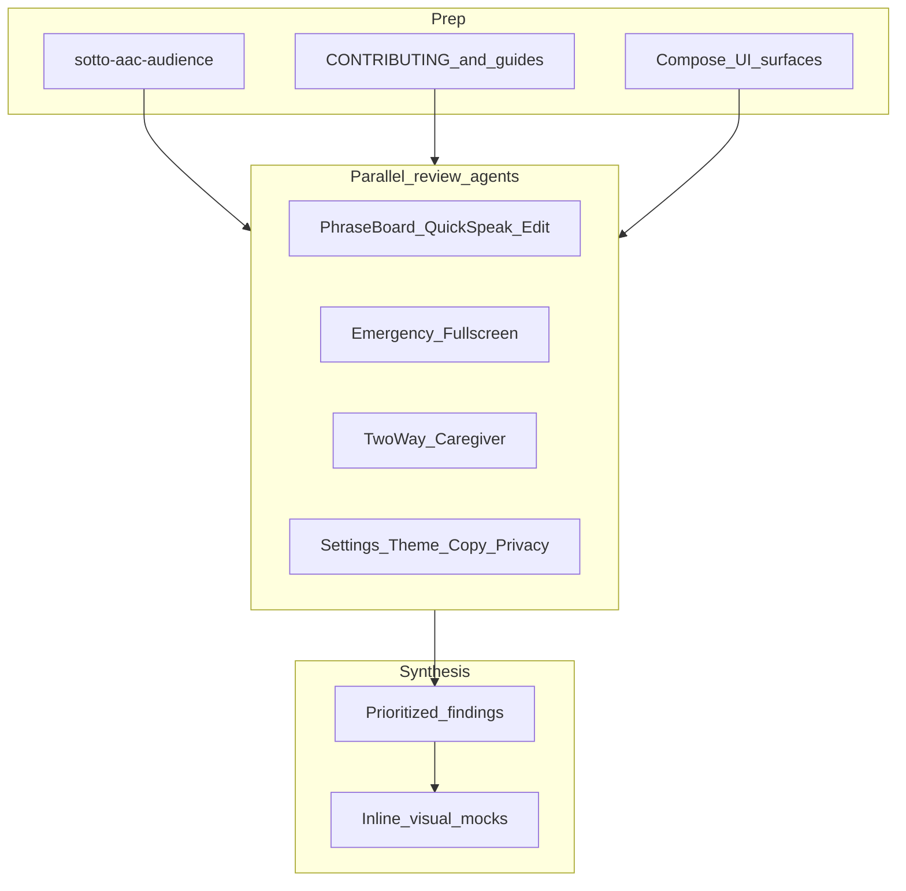

# Sotto Full-App UI/UX Audience Review Plan

## Goal

Produce a thorough UI/UX audit for Sotto target audience (autistic teens/adults, speech-impaired/non-speaking users, caregivers), phone-first. No hard design limits; every recommended change includes justification. Critical/High issues get inline visual mocks. No app code changes in this phase unless later approved.

## Guardrails and sources of truth

Reviewers apply:

- Project skill: [`.cursor/skills/sotto-aac-audience/SKILL.md`](../../.cursor/skills/sotto-aac-audience/SKILL.md)
- Mission: [CONTRIBUTING.md](../../CONTRIBUTING.md)
- Flows: [CAREGIVER_GUIDE.md](../CAREGIVER_GUIDE.md)
- Supporting: [PLAY_STORE_LISTING.md](../PLAY_STORE_LISTING.md), [assets/screenshot.png](../../assets/screenshot.png)
- Craft skills: `mobile-android-design`, `ui-ux-pro-max` (contrast, touch targets, Material 3)

Primary UI surfaces:

- [MainActivity.kt](../../app/src/main/java/com/amh/sotto/MainActivity.kt) — board, categories, Quick-Speak, emergency/fullscreen, Edit List, theme
- [TwoWayConversationDialog.kt](../../app/src/main/java/com/amh/sotto/ui/conversation/TwoWayConversationDialog.kt) — caregiver HUD, Flip, replies
- [VoiceSettingsDialog.kt](../../app/src/main/java/com/amh/sotto/ui/main/VoiceSettingsDialog.kt)
- Theme: [Theme.kt](../../app/src/main/java/com/amh/sotto/theme/Theme.kt), [Color.kt](../../app/src/main/java/com/amh/sotto/theme/Color.kt), [Type.kt](../../app/src/main/java/com/amh/sotto/theme/Type.kt)
- Strings / default phrases under `app/src/main/res/`

## Parallel agent assignments

Dispatch 4 agents in parallel. Read-only; shared finding schema.

1. **Phrase board** — Main speak surface, category chips, cards, Quick-Speak, Edit List/Done. Focus: one-tap speak, admin chrome leak, density/stimulus, touch size, categories under stress.
2. **Emergency** — Hero card, badge, long-press fullscreen, bystander share. Focus: shutdown discoverability, stranger contrast, honest copy, chrome competition.
3. **Caregiver Two-Way** — Ear dialog, STT/presets/type, Read Aloud, 180 Flip, Yes/No/Repeat/Wait. Focus: dignity, Flip face-to-face, cognitive load, motor targets.
4. **Settings / system** — Voice settings, chime/haptics, dual-language, theme/type, privacy vs code, Play Store and in-app copy. Focus: low-stimulus consistency, offline/privacy, tone, safe defaults.

Each finding includes: ID, severity (Critical/High/Medium/Low), surface + code location, observation, audience impact, recommendation + justification/tradeoffs, mock needed (Critical/High only).

## Synthesis

1. Deduplicate; resolve conflicts using sotto-aac-audience non-negotiables.
2. One report: short verdict, severity-ordered table, detail sections by journey (Speak, Emergency, Caregiver, Settings/Copy).
3. Inline phone-frame visual mocks for every Critical and High finding (current vs proposed; dark-neutral, mature, low-stimulus).
4. Call out strengths to keep.
5. End with P0/P1/P2 backlog — no implementation until approved.

## Out of scope this phase

- Implementing UI changes
- Tablet/foldable/iOS deep-dives (brief note only if spotted)
- Full doc rewrites (flag; short rewrite only if Critical/High)
- Security beyond privacy UX claims

## Success criteria

- All four surface areas covered
- Every recommendation justified with audience impact and tradeoffs
- Inline mocks for Critical/High
- Actionable backlog ready for a follow-up implementation plan

## Outcome

Plan executed. Findings and backlog: [UX_AUDIENCE_REVIEW.md](../UX_AUDIENCE_REVIEW.md).
